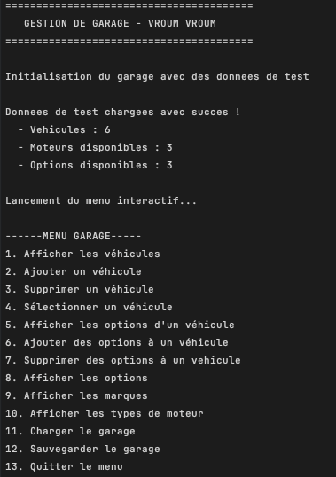
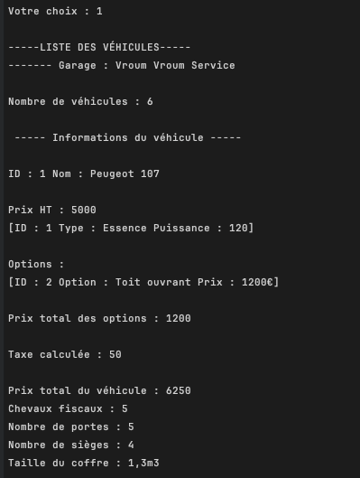

🚗 Gestion de Garage / Garage Management
🇫🇷 Application console en C# | 🇬🇧 C# Console Application

Une application complète de gestion de garage développée en C#, avec une architecture POO avancée, un menu interactif, et une persistance JSON.
A complete garage management application developed in C#, featuring advanced OOP architecture, an interactive menu, and JSON persistence.

📸 Aperçu / Preview

   

🎯 🇫🇷 Fonctionnalités / 🇬🇧 Features

| 🇫🇷 Français                                             | 🇬🇧 English                                          |
| --------------------------------------------------------- | ----------------------------------------------------- |
| ✅ Gestion de 3 types de véhicules (Voiture, Camion, Moto) | ✅ Manage 3 types of vehicles (Car, Truck, Motorcycle) |
| ✅ Système de gestion des moteurs et options               | ✅ Engine and options management system                |
| ✅ Calcul automatique des taxes selon le type de véhicule  | ✅ Automatic tax calculation based on vehicle type     |
| ✅ Tri des véhicules par prix (*IComparable*)              | ✅ Vehicle sorting by price (*IComparable*)            |
| ✅ Menu interactif avec 13 fonctionnalités                 | ✅ Interactive menu with 13 features                   |
| ✅ Sauvegarde/chargement JSON avec polymorphisme           | ✅ JSON save/load with polymorphism support            |
| ✅ Gestion d'exceptions personnalisées                     | ✅ Custom exception handling                           |
| ✅ Architecture respectant les principes SOLID             | ✅ SOLID architecture principles                       |

🏗️ Architecture du projet / Project Structure
GestionGarage/
├── Models/
│   ├── Enums/           # TypeMoteur / EngineType, Marque / Brand
│   ├── Vehicules/       # Classes abstraites + dérivées / Abstract & derived classes
│   ├── Option.cs
│   ├── Moteur.cs / Engine.cs
│   └── Garage.cs
├── Menu.cs              # Interface utilisateur / User interface
└── Program.cs

🛠️ Technologies
| 🇫🇷 Français                        | 🇬🇧 English                        |
| ------------------------------------ | ----------------------------------- |
| **Langage :** C# 12                  | **Language:** C# 12                 |
| **Framework :** .NET 8               | **Framework:** .NET 8               |
| **Sérialisation :** System.Text.Json | **Serialization:** System.Text.Json |
| **IDE :** JetBrains Rider            | **IDE:** JetBrains Rider            |

💻 Installation & Exécution / Installation & Run

# 🇫🇷 Cloner le dépôt / 🇬🇧 Clone the repository
git clone https://github.com/angelicalazaro/gestion-garage.git

# 🇫🇷 Se déplacer dans le dossier / 🇬🇧 Navigate to the folder
cd gestion-garage

# 🇫🇷 Exécuter l’application / 🇬🇧 Run the application
dotnet run

📚 Concepts techniques appliqués / Applied Technical Concepts
| 🇫🇷 Français                                                 | 🇬🇧 English                                                  |
| ------------------------------------------------------------- | ------------------------------------------------------------- |
| **POO avancée :** héritage, polymorphisme, classes abstraites | **Advanced OOP:** inheritance, polymorphism, abstract classes |
| **Interfaces :** IComparable pour le tri                      | **Interfaces:** IComparable for sorting                       |
| **Exceptions personnalisées :** MenuException                 | **Custom exceptions:** MenuException                          |
| **Sérialisation JSON :** gestion du polymorphisme             | **JSON serialization:** polymorphism handling                 |
| **Architecture en couches :** séparation Modèles / UI         | **Layered architecture:** Models/UI separation                |
